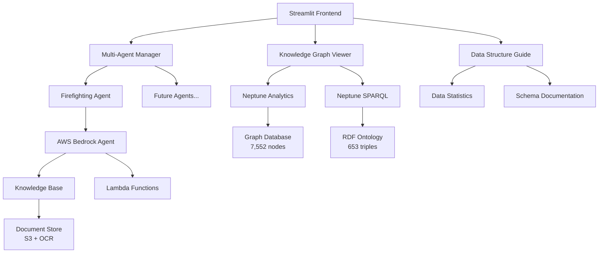

# 🚢 선박 소화 규칙 챗봇

[](https://python.org)
[](https://streamlit.io)
[](https://aws.amazon.com)
[](LICENSE)

대화형 지식 그래프 시각화 및 실시간 데이터 탐색 기능을 갖춘 정교한 멀티 에이전트 GraphRAG 기반 선박 소화 규정 챗봇 시스템입니다.

## 🌟 주요 기능

### 🤖 **멀티 에이전트 아키텍처**
- **모듈식 설계**: 다양한 규정 도메인을 위한 확장 가능한 에이전트 프레임워크
- **구성 기반**: YAML 구성을 통한 새로운 에이전트 쉬운 추가
- **지능형 라우팅**: 전문 에이전트로의 자동 쿼리 라우팅

### 🕸️ **대화형 지식 그래프**
- **GraphRAG 시각화**: Neptune Analytics의 7,552개 노드, 11,949개 관계
- **FSS 온톨로지 그래프**: SPARQL 기반 의미론적 관계 (653개 트리플)
- **실시간 탐색**: 대화형 노드 조작, 줌, 필터링

### 📊 **데이터 구조 안내서**
- **시스템 개요**: 포괄적인 데이터 아키텍처 문서화
- **Neptune Analytics**: 7,552개 노드와 11,949개 엣지를 가진 GraphRAG 구조
- **Neptune DB**: 653개 트리플과 42개 클래스를 가진 SPARQL 온톨로지
- **시각적 통계**: 실시간 메트릭 및 데이터 분포

### 💬 **지능형 채팅 시스템**
- **AWS Bedrock 통합**: 소스 속성이 포함된 고급 AI 기반 응답
- **문서 참조**: 원본 문서 이미지가 포함된 OCR 텍스트 추출
- **다국어 지원**: 한국어 및 영어 인터페이스
- **ReAct 패턴**: 고급 추론 및 행동 검색 기능

## 🏗️ 아키텍처 개요



## 🚀 빠른 시작

### 사전 요구사항
- Python 3.11+
- Bedrock 액세스가 가능한 AWS 계정
- 구성된 AWS CLI
- 가상 환경 (권장)

### 설치

1. **저장소 복제**
```bash
git clone https://github.com/your-username/ship-firefighting-chatbot.git
cd ship-firefighting-chatbot
```

2. **가상 환경 생성**
```bash
python -m venv venv
source venv/bin/activate  # Windows: venv\Scripts\activate
```

3. **의존성 설치**
```bash
pip install -r requirements.txt
```

4. **AWS 자격 증명 구성**
```bash
aws configure
# AWS Access Key ID, Secret Access Key, 리전(us-west-2) 입력
```

5. **환경 변수 설정**
```bash
cp .env.example .env
# 특정 AWS 리소스 ID로 .env 파일 편집
```

6. **애플리케이션 실행**
```bash
streamlit run app.py
```

애플리케이션은 `http://localhost:8501`에서 접속 가능합니다.

## 📁 프로젝트 구조

```
ship-firefighting-chatbot/
├── 📱 프론트엔드 & 핵심
│   ├── app.py                      # 메인 Streamlit 애플리케이션
│   ├── data_structure_guide.py     # 데이터 아키텍처 문서화
│   ├── knowledge_graph.py          # Neptune Analytics GraphRAG
│   ├── fss_full_graph.py          # FSS SPARQL 온톨로지 그래프
│   └── requirements.txt            # Python 의존성
│
├── 🤖 멀티 에이전트 시스템
│   ├── core/
│   │   └── agent_manager.py        # 중앙화된 에이전트 관리
│   ├── agents/
│   │   ├── base_agent.py           # 추상 기본 에이전트 클래스
│   │   └── firefighting_agent/     # 선박 소화 전문가
│   └── config/
│       └── agents.yaml             # 에이전트 구성
│
├── 🎨 사용자 인터페이스
│   └── ui/
│       ├── sidebar.py              # 네비게이션 및 제어
│       ├── chat_interface.py       # 채팅 기능
│       ├── reference_display.py    # 문서 뷰어
│       └── agent_selector.py       # 에이전트 선택
│
├── ☁️ AWS 배포
│   └── deployment/
│       ├── cloudfront-*.yaml       # CloudFront 구성
│       ├── alb-streamlit.yaml      # Application Load Balancer
│       └── deploy-cloudfront.sh    # 배포 자동화
│
├── 📚 문서
│   └── doc/
│       ├── app.md / app-ko.md      # 애플리케이션 가이드
│       ├── configuration.md        # 설정 지침
│       ├── deployment.md           # 배포 가이드
│       └── multi_agent_system.md   # 아키텍처 세부사항
│
└── 🔧 구성
    ├── .streamlit/config.toml      # Streamlit 설정
    ├── .env.example               # 환경 변수 템플릿
    └── .gitignore                 # Git 무시 규칙
```

## 🎯 사용 가이드

### 💬 채팅 인터페이스

1. **애플리케이션 시작**: `streamlit run app.py`
2. **에이전트 선택**: 사이드바에서 구성된 에이전트 선택
3. **질문하기**: 한국어 또는 영어로 입력
4. **참조 확인**: 참조 번호를 클릭하여 원본 문서 확인
5. **컨텍스트 탐색**: OCR 텍스트 및 원본 문서 이미지 확인

**예시 질문:**
```
한국어:
- "선박의 고정식 소화 시스템 요구사항을 알려주세요"
- "SOLAS Chapter II-2의 화재 감지 시스템 규정"

영어:
- "What are the requirements for ship fire detection systems?"
- "SOLAS regulations for portable fire extinguishers"
```

### 🕸️ 지식 그래프 탐색

1. **그래프 유형 선택**: 사이드바 옵션에서 선택
   - **GraphRAG**: 문서-엔티티 관계 (7,552개 노드)
   - **FSS 온톨로지**: 의미론적 규정 구조 (653개 트리플)

2. **대화형 기능**:
   - **노드 상호작용**: 노드 클릭 및 드래그
   - **줌 & 팬**: 마우스 제어로 네비게이션
   - **호버 세부정보**: 노드 정보 확인
   - **동적 레이아웃**: 물리 기반 위치 조정

### 📊 데이터 구조 안내서

1. **안내서 이동**: 사이드바에서 "📊 데이터 구조 안내서" 선택
2. **3개 탭 탐색**:
   - **📊 전체 현황**: Neptune Analytics와 Neptune DB 개요
   - **📚 GraphRAG**: Neptune Analytics 구조 및 통계
   - **🔥 GraphDB**: Neptune SPARQL 온톨로지 세부사항

3. **시스템 아키텍처 확인**:
   - **데이터 모델**: 노드, 엣지, 라벨, 프로퍼티 이해
   - **통계**: 두 그래프 시스템의 실시간 메트릭
   - **문서화**: 포괄적인 스키마 정보

## ⚙️ 구성

### AWS 리소스

현재 프로덕션 구성:
```yaml
# config/agents.yaml
agents:
  firefighting:
    display_name: "선박 소방 규정"
    description: "선박 소방 시스템 및 SOLAS 규정 전문가"
    bedrock_agent_id: "WT3ZJ25XCL"
    bedrock_alias_id: "3RWZZLJDY1"
    knowledge_base_id: "ZGBA1R5CS0"
    region: "us-west-2"
    enabled: true
```

### 환경 변수

```bash
# .env
AWS_REGION=us-west-2
BEDROCK_AGENT_ID=WT3ZJ25XCL
BEDROCK_ALIAS_ID=3RWZZLJDY1
KNOWLEDGE_BASE_ID=ZGBA1R5CS0
NEPTUNE_GRAPH_ID=g-gqisj8edd6
NEPTUNE_ENDPOINT=your-neptune-endpoint
```

## 🔧 개발

### 새로운 에이전트 추가

1. **에이전트 구조 생성**:
```bash
mkdir -p agents/new_agent
touch agents/new_agent/__init__.py
```

2. **에이전트 클래스 구현**:
```python
# agents/new_agent/agent.py
from agents.base_agent import BaseAgent

class Agent(BaseAgent):
    def process_message(self, message: str, session_id: str) -> Dict:
        # 구현 내용
        return {
            "response": "에이전트 응답",
            "references": [],
            "metadata": {}
        }
```

3. **구성 업데이트**:
```yaml
# config/agents.yaml
agents:
  new_agent:
    display_name: "새 에이전트"
    description: "에이전트 설명"
    bedrock_agent_id: "YOUR_AGENT_ID"
    bedrock_alias_id: "YOUR_ALIAS_ID"
    knowledge_base_id: "YOUR_KB_ID"
    enabled: true
```

### 테스트 유틸리티

```bash
# 에이전트 응답 테스트
python test_agent_trace.py

# 문서 참조 추출
python extract_references.py

# 지식 베이스 쿼리 테스트
python get_kb_text.py
```

### 코드 품질

- **타입 힌트**: Python 타입 어노테이션 사용
- **문서화**: 모든 클래스와 메서드에 독스트링
- **오류 처리**: 포괄적인 예외 처리
- **로깅**: 디버깅을 위한 구조화된 로깅

## 🚀 배포

### 로컬 개발
```bash
streamlit run app.py --server.port 8501
```

### ALB를 사용한 프로덕션
```bash
aws cloudformation deploy \
    --template-file deployment/alb-streamlit.yaml \
    --stack-name streamlit-alb \
    --parameter-overrides \
        VpcId=vpc-xxxxxxxxx \
        SubnetIds=subnet-xxx,subnet-yyy \
        CertificateArn=arn:aws:acm:region:account:certificate/cert-id
```

### CloudFront CDN (선택사항)
```bash
cd deployment
./deploy-cloudfront.sh
```

**참고**: CloudFront는 Streamlit과 WebSocket 호환성 문제가 있을 수 있습니다.

## 📊 시스템 메트릭

### 데이터 규모
- **Knowledge Base**: 10,000+ 문서 청크
- **Neptune Analytics**: 7,552개 노드, 11,949개 관계
- **SPARQL 온톨로지**: 653개 트리플, 42개 클래스
- **문서 저장소**: 500+ 규정 문서

### 성능
- **쿼리 응답**: 평균 3초 미만
- **그래프 렌더링**: 2,000+ 노드에 대해 5초 미만
- **검색 결과**: 관련성 점수와 함께 실시간
- **동시 사용자**: 10+ 동시 세션 지원

## 🔒 보안 및 안전

### 쿼리 안전
- **읽기 전용 작업**: 데이터 수정 방지
- **쿼리 검증**: 자동 안전 확인
- **속도 제한**: 리소스 남용 방지
- **입력 정화**: SQL 인젝션 방지

### AWS 보안
- **IAM 역할**: 최소 권한 접근
- **VPC 엔드포인트**: 프라이빗 네트워크 통신
- **암호화**: 저장 및 전송 중 데이터 암호화
- **감사 로깅**: CloudTrail 통합

## 📚 문서

포괄적인 문서를 확인할 수 있습니다:

- **[애플리케이션 가이드](doc/app.md)** - 사용자 인터페이스 및 기능
- **[멀티 에이전트 시스템](doc/multi_agent_system.md)** - 아키텍처 세부사항
- **[지식 그래프](doc/knowledge_graphs.md)** - 그래프 시각화
- **[구성](doc/configuration.md)** - 설정 및 사용자 정의
- **[배포](doc/deployment.md)** - 프로덕션 배포
- **[테스트 유틸리티](doc/testing_utilities.md)** - 개발 도구

한국어 버전은 `-ko` 접미사로 사용할 수 있습니다.

## 🤝 기여

1. **저장소 포크**
2. **기능 브랜치 생성**: `git checkout -b feature/new-feature`
3. **코드 표준 준수**: 타입 힌트, 독스트링, 오류 처리
4. **테스트 추가**: 새로운 기능에 대한 단위 테스트 포함
5. **문서 업데이트**: 변경사항과 문서 동기화 유지
6. **풀 리퀘스트 제출**: 변경사항에 대한 상세한 설명

### 개발 설정
```bash
# 개발 의존성 설치
pip install -r requirements-dev.txt

# 테스트 실행
pytest tests/

# 코드 포맷팅
black .
isort .

# 타입 검사
mypy .
```

## 📄 라이선스

이 프로젝트는 MIT 라이선스 하에 라이선스됩니다 - 자세한 내용은 [LICENSE](LICENSE) 파일을 참조하세요.

## 🆘 지원

- **이슈**: [GitHub Issues](https://github.com/your-username/ship-firefighting-chatbot/issues)
- **토론**: [GitHub Discussions](https://github.com/your-username/ship-firefighting-chatbot/discussions)
- **문서**: `doc/` 디렉토리 확인
- **명세서**: 상세한 요구사항은 `*.spec` 파일 참조

## 🙏 감사의 말

- **AWS Bedrock**: 고급 AI 기능 제공
- **Neptune**: 그래프 데이터베이스 서비스
- **Streamlit**: 빠른 웹 애플리케이션 개발
- **SOLAS/IMO**: 해양 안전 표준
- **DNV**: 선박 분류 규칙

---

**해양 안전 전문가를 위해 ❤️로 제작되었습니다**