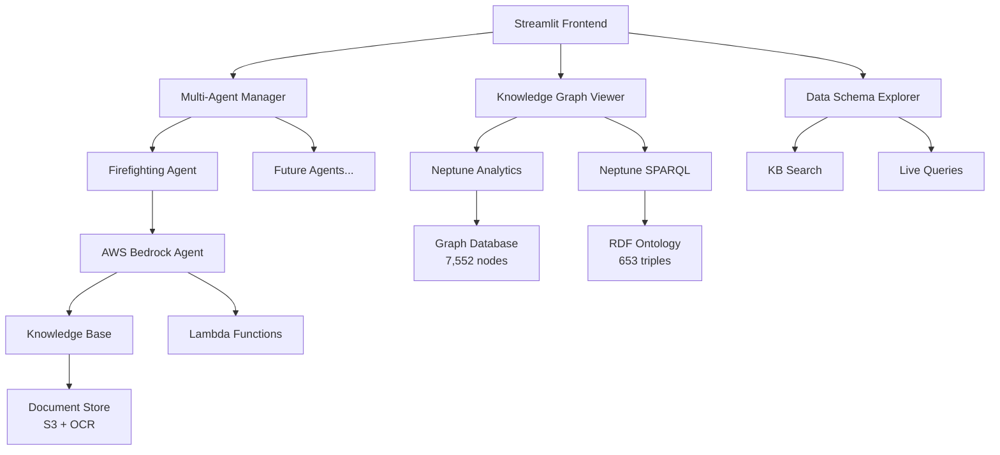

# 🚢 Ship Firefighting Rules Chatbot

[](https://python.org)
[](https://streamlit.io)
[](https://aws.amazon.com)
[](LICENSE)

A sophisticated multi-agent GraphRAG-powered chatbot system for ship firefighting regulations with interactive knowledge graph visualization and real-time data exploration capabilities.

## 🌟 Key Features

### 🤖 **Multi-Agent Architecture**
- **Modular Design**: Extensible agent framework for different regulation domains
- **Configuration-Driven**: Easy addition of new agents via YAML configuration
- **Intelligent Routing**: Automatic query routing to specialized agents

### 🕸️ **Interactive Knowledge Graphs**
- **GraphRAG Visualization**: 7,552 nodes, 11,949 relationships from Neptune Analytics
- **FSS Ontology Graph**: SPARQL-based semantic relationships (653 triples)
- **Real-time Exploration**: Interactive node manipulation, zoom, and filtering

### 📊 **Data Schema Explorer**
- **Live Query Execution**: Real-time openCypher and SPARQL query execution
- **Knowledge Base Search**: Direct search with relevance scoring
- **Schema Analysis**: Comprehensive data structure documentation
- **Safety Controls**: Read-only query validation and execution limits

### 💬 **Intelligent Chat System**
- **AWS Bedrock Integration**: Advanced AI-powered responses with source attribution
- **Document References**: OCR text extraction with original document images
- **Multi-language Support**: Korean and English interface
- **ReAct Pattern**: Advanced reasoning and acting search capabilities

## 🏗️ Architecture Overview



## 🚀 Quick Start

### Prerequisites
- Python 3.11+
- AWS Account with Bedrock access
- AWS CLI configured
- Virtual environment (recommended)

### Installation

1. **Clone the repository**
```bash
git clone https://github.com/your-username/ship-firefighting-chatbot.git
cd ship-firefighting-chatbot
```

2. **Create virtual environment**
```bash
python -m venv venv
source venv/bin/activate  # On Windows: venv\Scripts\activate
```

3. **Install dependencies**
```bash
pip install -r requirements.txt
```

4. **Configure AWS credentials**
```bash
aws configure
# Enter your AWS Access Key ID, Secret Access Key, and region (us-west-2)
```

5. **Set up environment variables**
```bash
cp .env.example .env
# Edit .env with your specific AWS resource IDs
```

6. **Run the application**
```bash
streamlit run app.py
```

The application will be available at `http://localhost:8501`

## 📁 Project Structure

```
ship-firefighting-chatbot/
├── 📱 Frontend & Core
│   ├── app.py                      # Main Streamlit application
│   ├── data_schema_explorer.py     # Real-time data exploration tool
│   ├── knowledge_graph.py          # Neptune Analytics GraphRAG
│   ├── fss_full_graph.py          # FSS SPARQL ontology graph
│   └── requirements.txt            # Python dependencies
│
├── 🤖 Multi-Agent System
│   ├── core/
│   │   └── agent_manager.py        # Centralized agent management
│   ├── agents/
│   │   ├── base_agent.py           # Abstract base agent class
│   │   └── firefighting_agent/     # Ship firefighting specialist
│   └── config/
│       └── agents.yaml             # Agent configuration
│
├── 🎨 User Interface
│   └── ui/
│       ├── sidebar.py              # Navigation and controls
│       ├── chat_interface.py       # Chat functionality
│       ├── reference_display.py    # Document viewer
│       └── agent_selector.py       # Agent selection
│
├── ☁️ AWS Deployment
│   └── deployment/
│       ├── cloudfront-*.yaml       # CloudFront configurations
│       ├── alb-streamlit.yaml      # Application Load Balancer
│       └── deploy-cloudfront.sh    # Deployment automation
│
├── 📚 Documentation
│   └── doc/
│       ├── app.md / app-ko.md      # Application guides
│       ├── configuration.md        # Setup instructions
│       ├── deployment.md           # Deployment guides
│       └── multi_agent_system.md   # Architecture details
│
└── 🔧 Configuration
    ├── .streamlit/config.toml      # Streamlit settings
    ├── .env.example               # Environment template
    └── .gitignore                 # Git ignore rules
```

## 🎯 Usage Guide

### 💬 Chat Interface

1. **Start the Application**: `streamlit run app.py`
2. **Select Agent**: Choose from configured agents in sidebar
3. **Ask Questions**: Type in Korean or English
4. **View References**: Click reference numbers for source documents
5. **Explore Context**: See OCR text and original document images

**Example Queries:**
```
Korean:
- "선박의 고정식 소화 시스템 요구사항을 알려주세요"
- "SOLAS Chapter II-2의 화재 감지 시스템 규정"

English:
- "What are the requirements for ship fire detection systems?"
- "SOLAS regulations for portable fire extinguishers"
```

### 🕸️ Knowledge Graph Exploration

1. **Select Graph Type**: Choose from sidebar options
   - **GraphRAG**: Document-entity relationships (7,552 nodes)
   - **FSS Ontology**: Semantic regulation structure (653 triples)

2. **Interactive Features**:
   - **Node Interaction**: Click and drag nodes
   - **Zoom & Pan**: Mouse controls for navigation
   - **Hover Details**: View node information
   - **Dynamic Layout**: Physics-based positioning

### 📊 Data Schema Explorer

1. **Navigate to Explorer**: Select "📊 데이터 스키마 탐색기" in sidebar
2. **Explore 4 Tabs**:
   - **📚 Knowledge Base**: Metadata and search statistics
   - **🕸️ Neptune Analytics**: Graph schema and openCypher queries
   - **🔗 Neptune SPARQL**: RDF ontology and SPARQL queries
   - **📋 Data Samples**: Real data examples and quality metrics

3. **Execute Live Queries**:
   - **Pre-built Examples**: Click "▶️ 실행" on example queries
   - **Custom Queries**: Write and execute your own queries
   - **Safety Validation**: Automatic read-only query checking

## ⚙️ Configuration

### AWS Resources

Current production configuration:
```yaml
# config/agents.yaml
agents:
  firefighting:
    display_name: "선박 소방 규정"
    description: "선박 소방 시스템 및 SOLAS 규정 전문가"
    bedrock_agent_id: "H5YNZKKNSW"
    bedrock_alias_id: "FD3LV7TEN4"
    knowledge_base_id: "ZGBA1R5CS0"
    region: "us-west-2"
    enabled: true
```

### Environment Variables

```bash
# .env
AWS_REGION=us-west-2
BEDROCK_AGENT_ID=H5YNZKKNSW
BEDROCK_ALIAS_ID=FD3LV7TEN4
KNOWLEDGE_BASE_ID=ZGBA1R5CS0
NEPTUNE_GRAPH_ID=g-gqisj8edd6
NEPTUNE_ENDPOINT=your-neptune-endpoint
```

## 🔧 Development

### Adding New Agents

1. **Create Agent Structure**:
```bash
mkdir -p agents/new_agent
touch agents/new_agent/__init__.py
```

2. **Implement Agent Class**:
```python
# agents/new_agent/agent.py
from agents.base_agent import BaseAgent

class Agent(BaseAgent):
    def process_message(self, message: str, session_id: str) -> Dict:
        # Your implementation here
        return {
            "response": "Agent response",
            "references": [],
            "metadata": {}
        }
```

3. **Update Configuration**:
```yaml
# config/agents.yaml
agents:
  new_agent:
    display_name: "New Agent"
    description: "Agent description"
    bedrock_agent_id: "YOUR_AGENT_ID"
    bedrock_alias_id: "YOUR_ALIAS_ID"
    knowledge_base_id: "YOUR_KB_ID"
    enabled: true
```

### Testing Utilities

```bash
# Test agent responses
python test_agent_trace.py

# Extract document references
python extract_references.py

# Test knowledge base queries
python get_kb_text.py
```

### Code Quality

- **Type Hints**: Use Python type annotations
- **Documentation**: Docstrings for all classes and methods
- **Error Handling**: Comprehensive exception handling
- **Logging**: Structured logging for debugging

## 🚀 Deployment

### Local Development
```bash
streamlit run app.py --server.port 8501
```

### Production with ALB
```bash
aws cloudformation deploy \
    --template-file deployment/alb-streamlit.yaml \
    --stack-name streamlit-alb \
    --parameter-overrides \
        VpcId=vpc-xxxxxxxxx \
        SubnetIds=subnet-xxx,subnet-yyy \
        CertificateArn=arn:aws:acm:region:account:certificate/cert-id
```

### CloudFront CDN (Optional)
```bash
cd deployment
./deploy-cloudfront.sh
```

**Note**: CloudFront may have WebSocket compatibility issues with Streamlit.

## 📊 System Metrics

### Data Scale
- **Knowledge Base**: 10,000+ document chunks
- **Neptune Analytics**: 7,552 nodes, 11,949 relationships
- **SPARQL Ontology**: 653 triples, 42 classes
- **Document Store**: 500+ regulation documents

### Performance
- **Query Response**: < 3 seconds average
- **Graph Rendering**: < 5 seconds for 2,000+ nodes
- **Search Results**: Real-time with relevance scoring
- **Concurrent Users**: Supports 10+ simultaneous sessions

## 🔒 Security & Safety

### Query Safety
- **Read-only Operations**: Prevents data modification
- **Query Validation**: Automatic safety checking
- **Rate Limiting**: Prevents resource abuse
- **Input Sanitization**: SQL injection prevention

### AWS Security
- **IAM Roles**: Least privilege access
- **VPC Endpoints**: Private network communication
- **Encryption**: Data at rest and in transit
- **Audit Logging**: CloudTrail integration

## 📚 Documentation

Comprehensive documentation available:

- **[Application Guide](doc/app.md)** - User interface and features
- **[Multi-Agent System](doc/multi_agent_system.md)** - Architecture details
- **[Knowledge Graphs](doc/knowledge_graphs.md)** - Graph visualization
- **[Configuration](doc/configuration.md)** - Setup and customization
- **[Deployment](doc/deployment.md)** - Production deployment
- **[Testing Utilities](doc/testing_utilities.md)** - Development tools

Korean versions available with `-ko` suffix.

## 🤝 Contributing

1. **Fork the Repository**
2. **Create Feature Branch**: `git checkout -b feature/new-feature`
3. **Follow Code Standards**: Type hints, docstrings, error handling
4. **Add Tests**: Include unit tests for new functionality
5. **Update Documentation**: Keep docs in sync with changes
6. **Submit Pull Request**: Detailed description of changes

### Development Setup
```bash
# Install development dependencies
pip install -r requirements-dev.txt

# Run tests
pytest tests/

# Code formatting
black .
isort .

# Type checking
mypy .
```

## 📄 License

This project is licensed under the MIT License - see the [LICENSE](LICENSE) file for details.

## 🆘 Support

- **Issues**: [GitHub Issues](https://github.com/your-username/ship-firefighting-chatbot/issues)
- **Discussions**: [GitHub Discussions](https://github.com/your-username/ship-firefighting-chatbot/discussions)
- **Documentation**: Check the `doc/` directory
- **Specifications**: See `*.spec` files for detailed requirements

## 🙏 Acknowledgments

- **AWS Bedrock**: For advanced AI capabilities
- **Neptune**: For graph database services
- **Streamlit**: For rapid web application development
- **SOLAS/IMO**: For maritime safety standards
- **DNV**: For ship classification rules

---

**Built with ❤️ for maritime safety professionals**