# 🤖 에이전트 개발 가이드

## 📋 목차
- [에이전트 아키텍처](#에이전트-아키텍처)
- [새 에이전트 개발](#새-에이전트-개발)
- [Plan-Execute Agent 분석](#plan-execute-agent-분석)
- [에이전트 테스트](#에이전트-테스트)
- [배포 및 등록](#배포-및-등록)
- [모범 사례](#모범-사례)

## 🏗️ 에이전트 아키텍처

### 시스템 구조
```
core/agent_manager.py     # 중앙 에이전트 관리자
├── 에이전트 로딩 및 등록
├── 메시지 라우팅
└── 세션 관리

agents/base_agent.py      # 추상 베이스 클래스
├── 공통 인터페이스 정의
├── 기본 메서드 구현
└── 에러 처리

agents/[agent_name]/      # 개별 에이전트 구현
├── __init__.py
├── agent.py             # 메인 에이전트 클래스
└── utils.py             # 유틸리티 함수 (선택적)

config/agents.yaml        # 에이전트 설정
```

### 에이전트 생명주기

```mermaid
graph LR
    A[설정 로드] --> B[에이전트 초기화]
    B --> C[메시지 수신]
    C --> D[메시지 처리]
    D --> E[응답 생성]
    E --> F[결과 반환]
    F --> C
```


## 🆕 새 에이전트 개발

### 1단계: 프로젝트 구조 생성

```bash
# 에이전트 디렉토리 생성
mkdir -p agents/my_agent
cd agents/my_agent

# 필수 파일 생성
touch __init__.py
touch agent.py
```

### 2단계: 베이스 에이전트 구현

```python
# agents/my_agent/agent.py
from typing import Dict, Any
from agents.base_agent import BaseAgent
import logging

logger = logging.getLogger(__name__)

class Agent(BaseAgent):
    """
    새로운 에이전트 구현
    
    이 에이전트는 [에이전트의 목적과 기능 설명]을 담당합니다.
    """
    
    def __init__(self):
        """에이전트 초기화"""
        super().__init__()
        self.name = "my_agent"
        logger.info(f"{self.name} 에이전트 초기화 완료")
    
    def process_message(self, message: str, session_id: str, **kwargs) -> Dict[str, Any]:
        """
        메시지 처리 메인 메서드
        
        Args:
            message: 사용자 입력 메시지
            session_id: 세션 ID
            **kwargs: 추가 파라미터 (kb_id 등)
            
        Returns:
            Dict: 처리 결과
            {
                "success": bool,
                "content": str,
                "references": List[Dict],
                "metadata": Dict
            }
        """
        try:
            logger.info(f"메시지 처리 시작: {message[:50]}...")
            
            # 1. 입력 검증
            if not message or not message.strip():
                return self._create_error_response("빈 메시지입니다.")
            
            # 2. 메시지 전처리
            processed_message = self._preprocess_message(message)
            
            # 3. 핵심 처리 로직
            result = self._process_core_logic(processed_message, session_id, **kwargs)
            
            # 4. 응답 후처리
            final_response = self._postprocess_response(result)
            
            logger.info("메시지 처리 완료")
            return final_response
            
        except Exception as e:
            logger.error(f"메시지 처리 중 오류: {e}")
            return self._create_error_response(f"처리 중 오류가 발생했습니다: {str(e)}")
    
    def _preprocess_message(self, message: str) -> str:
        """메시지 전처리"""
        # 메시지 정제, 정규화 등
        return message.strip()
    
    def _process_core_logic(self, message: str, session_id: str, **kwargs) -> Dict[str, Any]:
        """핵심 처리 로직"""
        # 여기에 에이전트의 주요 로직 구현
        
        # 예시: 간단한 응답 생성
        response_content = f"'{message}'에 대한 응답을 생성했습니다."
        
        return {
            "success": True,
            "content": response_content,
            "references": [],
            "metadata": {
                "agent": self.name,
                "session_id": session_id,
                "processing_time": 0.5
            }
        }
    
    def _postprocess_response(self, result: Dict[str, Any]) -> Dict[str, Any]:
        """응답 후처리"""
        # 응답 형식 검증, 추가 메타데이터 등
        return result
    
    def _create_error_response(self, error_message: str) -> Dict[str, Any]:
        """에러 응답 생성"""
        return {
            "success": False,
            "content": error_message,
            "references": [],
            "metadata": {
                "agent": self.name,
                "error": True
            }
        }
```

### 3단계: 에이전트 설정 추가

```yaml
# config/agents.yaml에 추가
agents:
  my_agent:
    display_name: "🆕 My Agent"
    description: "새로운 에이전트의 설명"
    bedrock_agent_id: "YOUR_AGENT_ID"      # 필요한 경우
    bedrock_alias_id: "YOUR_ALIAS_ID"      # 필요한 경우
    knowledge_base_id: "YOUR_KB_ID"        # 필요한 경우
    region: "us-west-2"
    enabled: true
    ui_config:
      icon: "🆕"
      color: "#9C27B0"
    custom_config:                          # 커스텀 설정
      max_tokens: 1000
      temperature: 0.7
```

### 4단계: 에이전트 등록 확인

```python
# agents/my_agent/__init__.py
from .agent import Agent

__all__ = ['Agent']
```

## 📊 Plan-Execute Agent 분석

현재 시스템의 주요 에이전트인 Plan-Execute Agent를 분석해보겠습니다.

### 아키텍처 개요

```python
# agents/plan_execute_agent/agent.py 주요 구조

class PlanExecuteAgent(BaseAgent):
    """
    Plan-Execute 패턴을 구현한 GraphRAG 에이전트
    
    워크플로우:
    1. 문서 계획 수립 (Claude Haiku)
    2. Neptune KB 검색
    3. Cohere Reranking
    4. 최종 응답 생성
    """
```

### 핵심 메서드 분석

#### **1. 메시지 처리 워크플로우**
```python
def process_message(self, message: str, session_id: str, **kwargs) -> Dict[str, Any]:
    """
    1. 문서 계획 수립
    2. Neptune 검색 실행
    3. Cohere 재순위화
    4. 한국어 응답 생성
    """
```

#### **2. 문서 계획 수립**
```python
def _create_document_plan(self, query: str) -> Dict:
    """
    Claude Haiku를 사용하여 검색 계획 수립
    
    입력: 사용자 질의 (한국어)
    출력: {
        "success": bool,
        "target_documents": List[str],
        "english_query": str,
        "reasoning": str
    }
    """
```

#### **3. Neptune KB 검색**
```python
def _execute_neptune_search(self, query: str, kb_id: str) -> List[Dict]:
    """
    Neptune Knowledge Base에서 문서 검색
    
    입력: 영어 쿼리, KB ID
    출력: 검색된 문서 리스트
    """
```

#### **4. Cohere 재순위화**
```python
def _cohere_rerank(self, query: str, documents: list) -> list:
    """
    Cohere 모델을 사용한 문서 재순위화
    
    입력: 쿼리, 문서 리스트
    출력: 재순위화된 문서 리스트 (rerank_score 포함)
    """
```

### 설정 구조

```yaml
# Plan-Execute Agent 설정 예시
plan_execute:
  display_name: "⚡ Plan-Execute Agent"
  description: "AWS IDP 패턴 기반 단순화된 GraphRAG 에이전트"
  bedrock_agent_id: "WT3ZJ25XCL"
  bedrock_alias_id: "3RWZZLJDY1"
  knowledge_base_id: "ZGBA1R5CS0"
  region: "us-west-2"
  enabled: true
  ui_config:
    icon: "⚡"
    color: "#FF6B35"
```

## 🧪 에이전트 테스트

### 단위 테스트 작성

```python
# tests/test_my_agent.py
import unittest
from agents.my_agent.agent import Agent

class TestMyAgent(unittest.TestCase):
    
    def setUp(self):
        """테스트 설정"""
        self.agent = Agent()
        self.test_session_id = "test_session_123"
    
    def test_basic_message_processing(self):
        """기본 메시지 처리 테스트"""
        message = "테스트 메시지입니다"
        result = self.agent.process_message(message, self.test_session_id)
        
        self.assertTrue(result["success"])
        self.assertIn("content", result)
        self.assertIsInstance(result["references"], list)
    
    def test_empty_message_handling(self):
        """빈 메시지 처리 테스트"""
        result = self.agent.process_message("", self.test_session_id)
        
        self.assertFalse(result["success"])
        self.assertIn("빈 메시지", result["content"])
    
    def test_error_handling(self):
        """에러 처리 테스트"""
        # 의도적으로 에러를 발생시키는 테스트
        pass

if __name__ == "__main__":
    unittest.main()
```

### 통합 테스트

```python
# test_agent_integration.py
from core.agent_manager import AgentManager

def test_agent_integration():
    """에이전트 통합 테스트"""
    
    # 1. Agent Manager 초기화
    manager = AgentManager()
    
    # 2. 에이전트 로드 확인
    agents = manager.get_available_agents()
    agent_names = [agent.name for agent in agents]
    assert "my_agent" in agent_names
    
    # 3. 메시지 라우팅 테스트
    result = manager.route_message(
        agent_name="my_agent",
        message="테스트 메시지",
        session_id="test_session"
    )
    
    assert result["success"] == True
    print("✅ 통합 테스트 통과")

if __name__ == "__main__":
    test_agent_integration()
```

### 성능 테스트

```python
# test_agent_performance.py
import time
from agents.my_agent.agent import Agent

def test_response_time():
    """응답 시간 테스트"""
    agent = Agent()
    
    start_time = time.time()
    result = agent.process_message("성능 테스트", "perf_session")
    end_time = time.time()
    
    response_time = end_time - start_time
    
    print(f"응답 시간: {response_time:.2f}초")
    assert response_time < 5.0  # 5초 이내 응답
    assert result["success"] == True

if __name__ == "__main__":
    test_response_time()
```

## 🚀 배포 및 등록

### 1. 에이전트 검증

```bash
# 구문 검사
python -m py_compile agents/my_agent/agent.py

# 타입 검사 (mypy 설치된 경우)
mypy agents/my_agent/agent.py

# 테스트 실행
python -m pytest tests/test_my_agent.py
```

### 2. 설정 검증

```python
# validate_config.py
import yaml
from pathlib import Path

def validate_agent_config():
    """에이전트 설정 검증"""
    config_path = Path("config/agents.yaml")
    
    with open(config_path, 'r', encoding='utf-8') as f:
        config = yaml.safe_load(f)
    
    # 필수 필드 검증
    required_fields = ['display_name', 'description', 'enabled']
    
    for agent_name, agent_config in config['agents'].items():
        for field in required_fields:
            assert field in agent_config, f"{agent_name}에 {field} 필드가 없습니다"
        
        print(f"✅ {agent_name} 설정 검증 완료")

if __name__ == "__main__":
    validate_agent_config()
```

### 3. UI 통합 테스트

```bash
# Streamlit 앱 실행
streamlit run app.py

# 브라우저에서 확인:
# 1. 사이드바에서 새 에이전트 선택 가능한지 확인
# 2. 메시지 전송 및 응답 확인
# 3. 에러 처리 확인
```

## 💡 모범 사례

### 1. **코드 구조**

#### **단일 책임 원칙**
```python
# ✅ 좋은 예: 각 메서드가 하나의 책임만 가짐
def _preprocess_message(self, message: str) -> str:
    """메시지 전처리만 담당"""
    return message.strip().lower()

def _validate_input(self, message: str) -> bool:
    """입력 검증만 담당"""
    return bool(message and message.strip())

# ❌ 나쁜 예: 하나의 메서드가 여러 책임을 가짐
def process_everything(self, message: str) -> Dict:
    """전처리, 검증, 처리, 후처리를 모두 담당"""
    # 너무 많은 책임...
```

#### **에러 처리**
```python
# ✅ 좋은 예: 구체적인 에러 처리
try:
    result = self._call_external_api(message)
except ConnectionError as e:
    logger.error(f"API 연결 실패: {e}")
    return self._create_error_response("외부 서비스에 연결할 수 없습니다.")
except TimeoutError as e:
    logger.error(f"API 타임아웃: {e}")
    return self._create_error_response("응답 시간이 초과되었습니다.")
except Exception as e:
    logger.error(f"예상치 못한 오류: {e}")
    return self._create_error_response("처리 중 오류가 발생했습니다.")

# ❌ 나쁜 예: 모든 에러를 동일하게 처리
try:
    result = self._call_external_api(message)
except Exception as e:
    return {"success": False, "content": "오류 발생"}
```

### 2. **성능 최적화**

#### **응답 시간 관리**
```python
import time
from typing import Dict, Any

def process_message(self, message: str, session_id: str, **kwargs) -> Dict[str, Any]:
    start_time = time.time()
    
    try:
        # 처리 로직
        result = self._process_core_logic(message, session_id, **kwargs)
        
        # 응답 시간 추가
        result["metadata"]["response_time"] = time.time() - start_time
        
        return result
    except Exception as e:
        return {
            "success": False,
            "content": str(e),
            "metadata": {
                "response_time": time.time() - start_time,
                "error": True
            }
        }
```

#### **캐싱 활용**
```python
from functools import lru_cache

class Agent(BaseAgent):
    
    @lru_cache(maxsize=100)
    def _get_cached_result(self, query: str) -> str:
        """자주 사용되는 쿼리 결과 캐싱"""
        # 비용이 높은 연산
        return expensive_operation(query)
```

### 3. **로깅 및 모니터링**

```python
import logging
from datetime import datetime

logger = logging.getLogger(__name__)

class Agent(BaseAgent):
    
    def process_message(self, message: str, session_id: str, **kwargs) -> Dict[str, Any]:
        # 요청 로깅
        logger.info(f"[{session_id}] 메시지 처리 시작: {message[:50]}...")
        
        try:
            result = self._process_core_logic(message, session_id, **kwargs)
            
            # 성공 로깅
            logger.info(f"[{session_id}] 처리 완료 - 응답 길이: {len(result.get('content', ''))}")
            
            return result
            
        except Exception as e:
            # 에러 로깅
            logger.error(f"[{session_id}] 처리 실패: {e}", exc_info=True)
            raise
```

### 4. **설정 관리**

```python
from typing import Dict, Any
import yaml

class Agent(BaseAgent):
    
    def __init__(self):
        super().__init__()
        self.config = self._load_agent_config()
    
    def _load_agent_config(self) -> Dict[str, Any]:
        """에이전트별 설정 로드"""
        with open("config/agents.yaml", 'r', encoding='utf-8') as f:
            config = yaml.safe_load(f)
        
        agent_config = config['agents'].get(self.name, {})
        
        # 기본값 설정
        default_config = {
            "max_tokens": 1000,
            "temperature": 0.7,
            "timeout": 30
        }
        
        return {**default_config, **agent_config.get('custom_config', {})}
```

## 📚 참고 자료

### 관련 문서
- **[System Overview](SYSTEM_OVERVIEW.md)**: 전체 시스템 아키텍처
- **[Configuration Guide](CONFIGURATION_GUIDE.md)**: 설정 가이드
- **[Troubleshooting](TROUBLESHOOTING.md)**: 문제 해결 가이드

### 코드 예시
- **`agents/plan_execute_agent/agent.py`**: 실제 구현 예시
- **`agents/base_agent.py`**: 베이스 클래스 구조
- **`core/agent_manager.py`**: 에이전트 관리 로직

### 외부 리소스
- **[AWS Bedrock Agent 문서](https://docs.aws.amazon.com/bedrock/latest/userguide/agents.html)**
- **[Streamlit 문서](https://docs.streamlit.io/)**
- **[Python 타입 힌트](https://docs.python.org/3/library/typing.html)**

---

**마지막 업데이트**: 2024년 11월