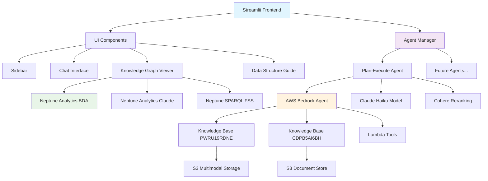

# 🚢 선박 소방 규정 챗봇 시스템 아키텍처

## 📋 목차
- [시스템 개요](#시스템-개요)
- [아키텍처 다이어그램](#아키텍처-다이어그램)
- [핵심 컴포넌트](#핵심-컴포넌트)
- [데이터 플로우](#데이터-플로우)
- [기술 스택](#기술-스택)
- [배포 구조](#배포-구조)

## 🎯 시스템 개요

선박 소방 규정 챗봇은 **멀티 에이전트 GraphRAG 시스템**으로, SOLAS 및 FSS 규정에 대한 전문적인 질의응답을 제공합니다.

### 주요 특징
- **멀티 에이전트 아키텍처**: 확장 가능한 에이전트 시스템
- **GraphRAG 기반**: Neptune Analytics + Knowledge Base 통합
- **멀티모달 지원**: 텍스트 + 이미지 처리
- **실시간 지식 그래프**: 인터랙티브 시각화
- **한국어/영어 지원**: 다국어 인터페이스

## 🏗️ 아키텍처 다이어그램



## 🔧 핵심 컴포넌트

### 1. **Frontend Layer (Streamlit)**
```
app.py                 # 메인 애플리케이션
├── ui/
│   ├── sidebar.py           # 네비게이션 & 컨트롤
│   ├── chat_interface.py    # 채팅 인터페이스
│   ├── reference_display.py # 참조 문서 표시
│   └── agent_selector.py    # 에이전트 선택
├── data_structure_guide.py  # 데이터 구조 탐색기
├── knowledge_graph_*.py     # 지식 그래프 뷰어
└── fss_full_graph.py       # FSS 온톨로지 그래프
```

### 2. **Agent Management Layer**
```
core/
├── agent_manager.py    # 중앙 에이전트 관리자
└── __init__.py

agents/
├── base_agent.py       # 추상 베이스 클래스
├── plan_execute_agent/ # Plan-Execute 에이전트
│   ├── agent.py       # 메인 구현
│   └── __init__.py
└── __init__.py

config/
└── agents.yaml        # 에이전트 설정
```

### 3. **Knowledge Systems**

#### **AWS Bedrock Agents**
- **PWRU19RDNE**: Claude + Neptune (멀티모달)
- **CDPB5AI6BH**: BDA + Neptune (텍스트)

#### **Knowledge Bases**
- **S3 Storage**: `s3://claude-neptune` (멀티모달)
- **Document Store**: OCR 텍스트 + 원본 이미지
- **Lambda Tools**: 검색 및 처리 함수

#### **Graph Databases**
- **Neptune Analytics BDA**: 7,552 노드, 11,949 엣지
- **Neptune Analytics Claude**: 문서-엔티티 관계
- **Neptune SPARQL**: FSS 온톨로지 (653 트리플)

## 🔄 데이터 플로우

### 1. **사용자 질의 처리**
```
사용자 입력 → Agent Manager → Plan-Execute Agent → Bedrock Agent → Knowledge Base → 응답 생성
```

### 2. **Plan-Execute 워크플로우**
```
1. 문서 계획 수립 (Claude Haiku)
2. Neptune KB 검색
3. Cohere Reranking
4. 최종 응답 생성 (한국어)
```

### 3. **멀티모달 처리**
```
텍스트 + 이미지 → S3 Storage → OCR 처리 → Knowledge Base → 통합 응답
```

### 4. **지식 그래프 시각화**
```
Neptune Analytics → OpenCypher 쿼리 → Pyvis 네트워크 → 인터랙티브 그래프
Neptune SPARQL → SPARQL 쿼리 → FSS 온톨로지 → 시맨틱 그래프
```

## 💻 기술 스택

### **Frontend**
- **Streamlit**: 웹 애플리케이션 프레임워크
- **Pyvis**: 네트워크 그래프 시각화
- **Plotly**: 데이터 시각화

### **Backend**
- **Python 3.11+**: 메인 언어
- **AWS Bedrock**: AI 모델 서비스
- **AWS Neptune**: 그래프 데이터베이스
- **AWS Lambda**: 서버리스 함수

### **AI/ML**
- **Claude 3 Haiku**: 계획 수립 및 응답 생성
- **Cohere**: 문서 재순위화
- **AWS Bedrock Agent**: 통합 AI 에이전트

### **Storage**
- **Amazon S3**: 문서 및 이미지 저장
- **DynamoDB**: OCR 메타데이터 (선택적)

## 🚀 배포 구조

### **로컬 개발**
```bash
streamlit run app.py --server.port 8501
```

### **AWS 배포 옵션**

#### **1. ALB + EC2 (권장)**
```
Internet → ALB → EC2 Instance → Streamlit App
```

#### **2. CloudFront + ALB (선택적)**
```
Internet → CloudFront → ALB → EC2 Instance → Streamlit App
```
*주의: WebSocket 호환성 문제 가능*

### **환경 설정**
```bash
# 필수 환경변수
AWS_REGION=us-west-2
BEDROCK_AGENT_ID=WT3ZJ25XCL
BEDROCK_ALIAS_ID=3RWZZLJDY1
KNOWLEDGE_BASE_ID=ZGBA1R5CS0
NEPTUNE_GRAPH_ID=g-gqisj8edd6
```

## 📊 시스템 메트릭

### **데이터 규모**
- **Knowledge Base**: 10,000+ 문서 청크
- **Neptune Analytics**: 7,552 노드, 11,949 관계
- **SPARQL 온톨로지**: 653 트리플, 42 클래스
- **Document Store**: 500+ 규정 문서

### **성능 지표**
- **쿼리 응답**: < 3초 평균
- **그래프 렌더링**: < 5초 (2,000+ 노드)
- **검색 결과**: 실시간 관련성 점수
- **동시 사용자**: 10+ 세션 지원

## 🔒 보안 & 안전

### **쿼리 안전성**
- **읽기 전용**: 데이터 수정 방지
- **쿼리 검증**: 자동 안전성 검사
- **속도 제한**: 리소스 남용 방지
- **입력 검증**: SQL 인젝션 방지

### **AWS 보안**
- **IAM 역할**: 최소 권한 접근
- **VPC 엔드포인트**: 프라이빗 네트워크
- **암호화**: 저장 및 전송 중 데이터
- **감사 로깅**: CloudTrail 통합

## 🔧 확장성

### **새 에이전트 추가**
1. `agents/` 폴더에 새 에이전트 구현
2. `config/agents.yaml`에 설정 추가
3. `AgentManager`가 자동으로 로드

### **새 Knowledge Base 추가**
1. AWS Bedrock에서 KB 생성
2. `agents.yaml`에 KB ID 추가
3. UI에서 선택 가능

### **새 그래프 추가**
1. Neptune에서 그래프 생성
2. 새 `knowledge_graph_*.py` 파일 생성
3. `app.py`에 라우팅 추가

## 📚 관련 문서

- **[Configuration Guide](CONFIGURATION_GUIDE.md)**: 설정 상세 가이드
- **[Agent Development](AGENT_DEVELOPMENT.md)**: 새 에이전트 개발
- **[Troubleshooting](TROUBLESHOOTING.md)**: 문제 해결 가이드
- **[doc/](doc/)**: 상세 기술 문서

---

**마지막 업데이트**: 2024년 11월
**버전**: 2.0 (멀티 에이전트 아키텍처)